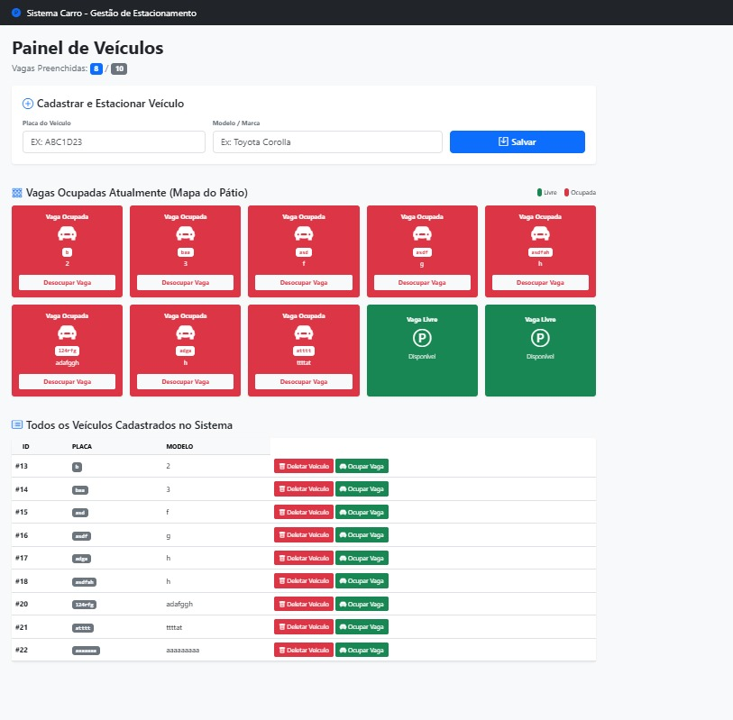

# Carros

realizado commit inicial, sendo creadas as outras operações de banco...
adicionar veiculos pela home e listar veiculos ok
deletar veiculos ok
vaga ocupada pela metade a implementação , zero testes ainda.

Criado requeremets ok

Versão final da primeira aula completa.

Uso de Pyteste no projeto para aprendizado.

